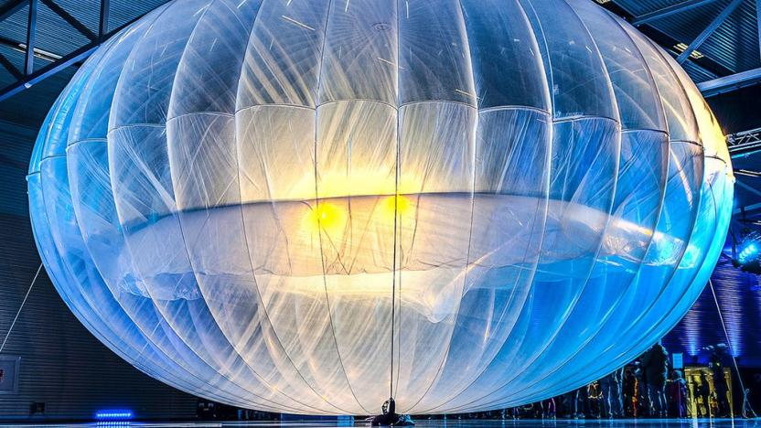
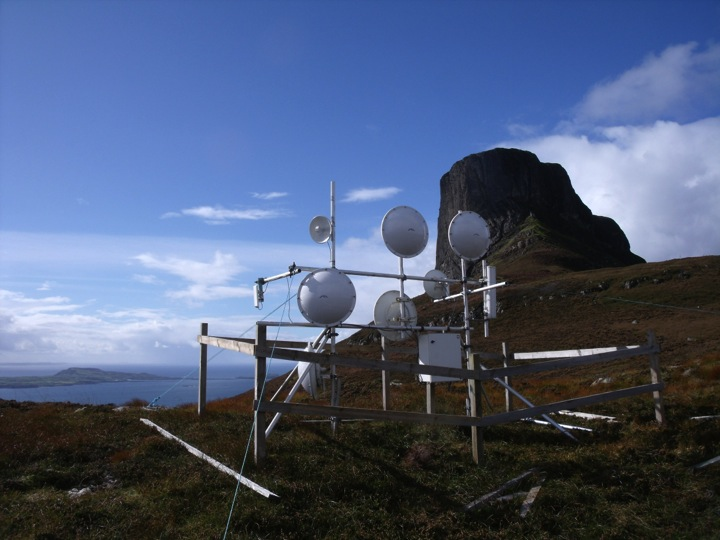
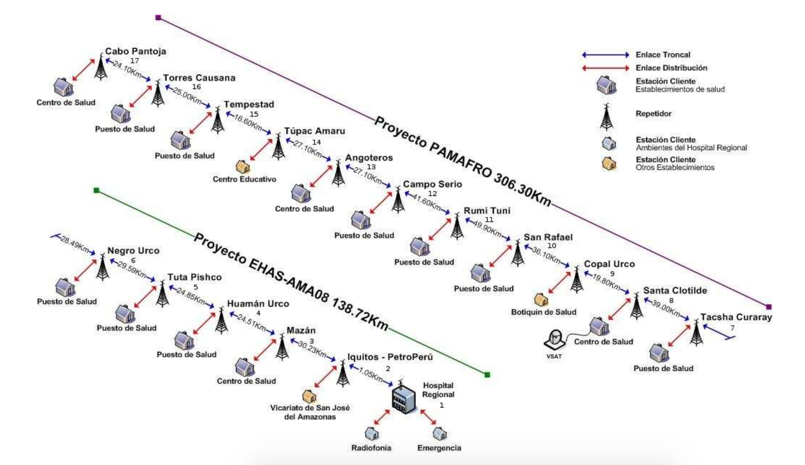
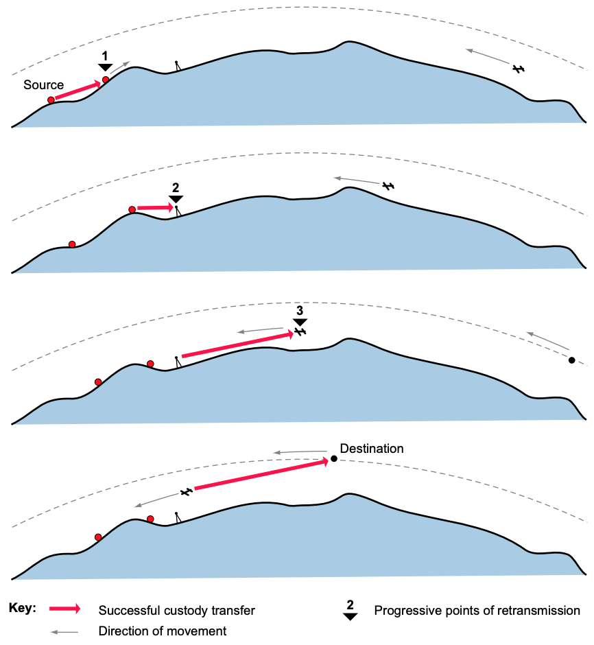

# Das andere Internet

<!-- https://static.techspot.com/images2/news/bigimage/2016/07/2016-07-07-image-31-j.webp -->

<!-- https://thenewshawks.com/wp-content/uploads/2021/05/electricity-1.jpg -->

<!-- https://reset.org/files/imagecache/sc_832x468/2021/02/03/1024px-google_loon_-_launch_event.jpg -->

<!-- http://www.tegola.org.uk/hebnet/hebnet-pics/Slide08.jpg -->

