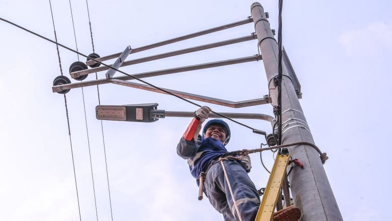
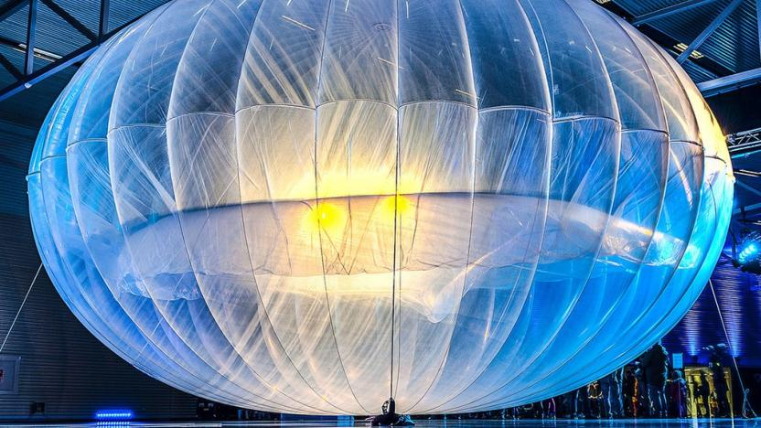
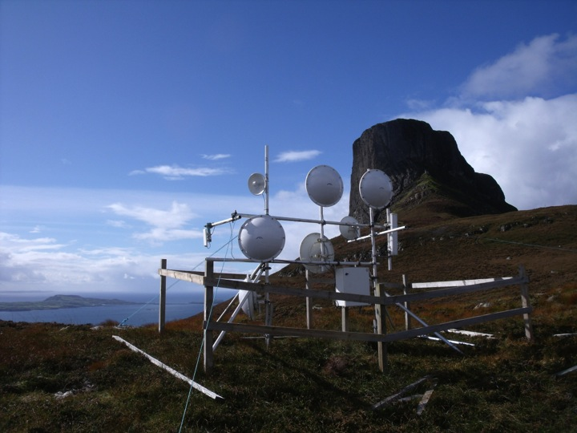
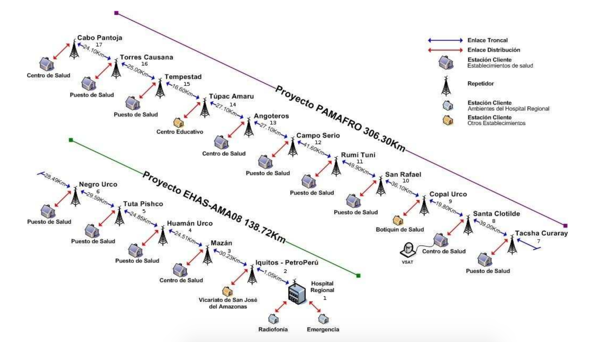
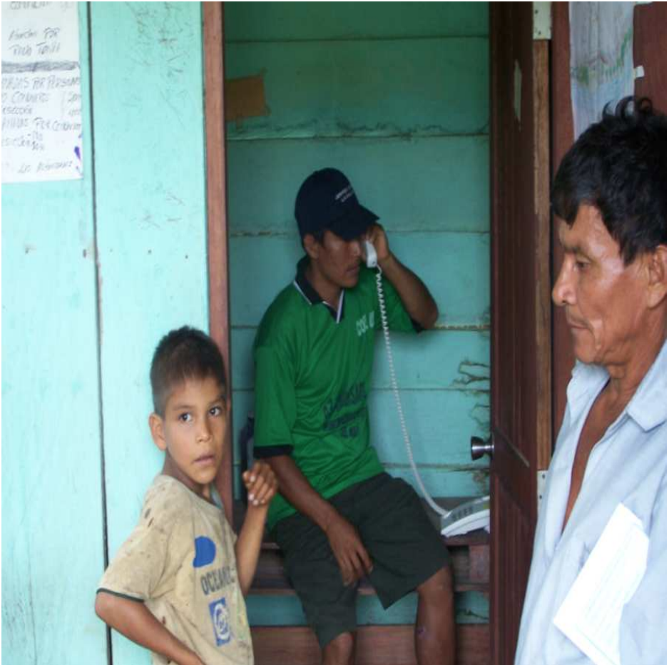
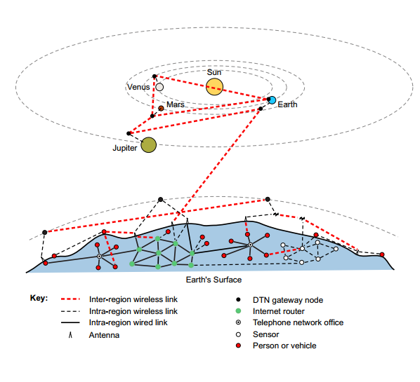
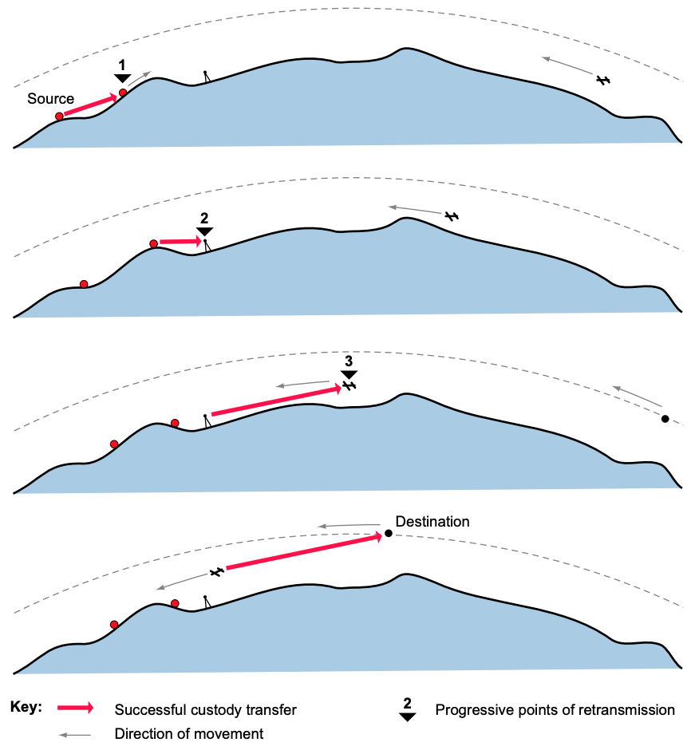

# Das andere Internet (ein Lowtech Ansatz)

<!-- https://static.techspot.com/images2/news/bigimage/2016/07/2016-07-07-image-31-j.webp -->

- **[SLIDE]** Wir alle wissen es: kabelloses Internet hat in letzten Jahren eine immer stärkere Verbreitung erreicht
- Nicht nur in unserem persönlichen Alltag, sondern in unserer gesamten modernen Konsumgesellschaft sind Dauerbetrieb und immer schnellere Verbindungsgeschwindigkeiten des Internets an der Tagesordnung
- Unser mobiles Internet geprägt von Begriffen, wie 3G - 4G - 5G (bis vor ein paar Monaten noch rein technisch belegt, inzwischen ist 2G in einem anderen Zusammenhang wieder modern)
- Hightech-Ansatz treibt Kosten und Energieverbrauch des Internets immer höher und höher (die letzte 3G Antenne wurde am 30.12.21 in meiner Nähe abgeschaltet)
- Bemühungen diese Faktoren zu erfassen sind schwierig
- denn schwer zu beziffern, wieviel Energie das Internet wirklich verbraucht, da hohe Komplexität des Netzwerks und schneller Wandel
- Studien haben oft nur den Energieverbrauch der Rechenzentren beachtet
- Endgeräte (PC, Laptops, Smartphones), Netzwerk-Infrastuktur (zwischen Clients und Servern) und die Herstellung aller Geräte haben auch ihren Anteil
- Technologie wird über die Jahre immer effizienter: Kosten und Energiebedarf pro übertragenem Bit sind deutlich gesunken
- wäre trotzdem nicht mit regenerativen Energien (Solar + Windkraft) abdeckbar
- wichtigster Grund ist verändertes Nutzerverhalten
- portable Endgeräte (die für sich selbst weniger Strom benötigen) haben stationäre abgelöst
- Rechenleistung damit in Datenzentren verlagert
- sie brachten aber auch ein mehr an Zeit mit sich, die User im Internet verbringen (~5000 mal am Tag anfassen)
- das Smartphone ersetzt zudem oft nicht den Laptop, sondern ergänzt ihn
- konsumierte Inhalte haben sich verändert: besonders kritisch ist hoher Anteil an Videostreaming (modernere Geräte brachten höhere Bitraten)
- ein viel höherer Datenverkehr ist die Folge, der dann auf letzter Meile auch noch zunehmend über mobile Datenverbindungen abgewickelt wird
- jede Generation (3G-4G-5G) treibt Energieverbrauch in die Höhe

<!-- https://thenewshawks.com/wp-content/uploads/2021/05/electricity-1.jpg -->

- **[SLIDE]** die Folge: Energieverbrauch pro Nutzer hat deutlich zugenommen
- auch in Entwicklungsländern schreitet die Modernisierung voran (teilweise deutlich teurer), vor allem im ländlichen Raum ist ein solches Internet aber nicht vorstellbar <!-- https://www.dw.com/de/afrika-mobilfunk-mobiles-internet-preise-preisunterschiede-datenjournalismus-daten-analyse-malawi/a-55448268 -->
- erst recht außerhalb der Städte erfordert eingeschränkte und nicht ausfallsichere Energieversorgung günstigere und wesentlich energieeffizientere Lösungen
- Zugang zum Internet steht hier im Vordergrund

<!-- https://reset.org/files/imagecache/sc_832x468/2021/02/03/1024px-google_loon_-_launch_event.jpg -->

- **[SLIDE]** mit Drohnen und Gasballons haben Google und Facebook eigene Lösungen in die Schlagzeilen gebracht
- große technische Herausforderungen und kommerzieller Charakter sind Hauptkritikpunkte
- Googles Projekt Loon zum Anfang des Jahres 2021 eingestellt (Flightradar24)
- dabei treten alternative Lösungen wieder zum Vorschein (z.B. kabelgebundenes Internet, spezielle Modems<!-- https://reset.org/blog/brck-diese-steine-verbinden-afrika-09252018 -->)
- u.a. deutlich günstigere asynchrone Lowtech-Netzwerke (von Forschungsgruppen entwickelt), die sich gut mit erneuerbaren Energien kombinieren lassen und widerstandsfähig gegen Ausfälle und Störungen sind, sind ein interessanter Ansatzpunkt
- technische Grundlage: WLAN

<!-- http://www.tegola.org.uk/hebnet/hebnet-pics/Slide08.jpg -->

<!--
- 
- 
-->

- **[SLIDE]** Kabelverbindungen wären energetisch besser geeignet
- WLAN im Vergleich dazu aber nur mit einem geringen Plus an Energieverbrauch, dafür aber viel flexibler
- 3G würde 15-faches an Energie von WLAN benötigen, bei 4G wäre es gar das 23-fache
- ursprünglich für kurze Distanzen von etwa 30 Metern entwickelt, lässt sich WLAN-Reichweite durch Modifikationen des Netzwerkprotokolls, durch Signalverstärker, Repeater und Richtantennen auf über 100 Kilometer erhöhen
- meist bestehen die WLAN-basierten Netzwerke aber aus Kombination von kürzeren Direktverbindungen

- **[SLIDE]** beide Endpunkte müssen miteinander Sichtverbindung haben
- geht das nicht, werden eine oder mehrere Relaisstationen mit Blickkontakt zu jeweils zwei Punkten benötigt
- Direktverbindungen bestehen damit prinzipiell aus zwei Richtantennen
- ein Knotenpunkt kann auch mehrere Antennen haben, um eine Vermaschung zu erhalten, die alternative Verbindungswege ermöglicht
- Verteilerknoten verteilen Signal lokal an Haushalte oder öffentliche Einrichtungen über Rundstrahlantennen oder konventionelle WLAN-Router
- für Zugriff auf Internet gibt es mindestens einen Gateway-Punkt, der ans Internet angebunden ist (Modem- oder Breitbandverbindung)
- solche Langstrecken-WLAN bieten vergleichsweise hohe Bandbreiten (bis zu 54 MBit/s) in Verbindung mit sehr niedrigen Investitionskosten (hohe Verbreitung des WLAN-Standards)
- niedriger Strombedarf: typische Installation mit zwei Langstrecken-Verbindungsstücken und einer oder zwei WLAN-Karten benötigen etwa 30 Watt Leistung (mit Solarzellen und Batterien betrieben)

- **[SLIDE]** unlizensierte Frequenzen (2,4 und 5 Ghz) ermöglichen praktisch jedem Teilnahme am Netzwerk
- Gemeinschaftsnetzwerke in Europa (guifi.net, Freifunk) mit eingeschränkter Bedeutung

- **[SLIDE]** in Entwicklungsländern (in Afrika oder auch Indien) wird so Menschen in abgelegenen Dörfern ein Internetzugang ermöglicht (öffentliche Einrichtungen)
- zweite Einsatzgebiet: Telemedizin für abgelegene Regionen mit kaum ausgebildetem Gesundheitspersonal
- Ärzte von städtischen Krankenhäusern können in Echtzeit über Audio und Video unterstützen (Peru 450km Netzwerk, Indien, Malawi, Ghana)
- Telemedizin hat hohe verfügbare Bandbreite
- aber je mehr Nutzer in so einem Netzwerk, desto geringer Bandbreite -- langsame Verbindungen
- zudem Energieversorgung oft lückenhaft
- unter diesem Bedingungen funktionieren Internetapplikationen eher schlecht
- Kommunikationsmodell des Internets basiert auf einer Reihe von Annahmen über das Netzwerk (TCP/IP Protokoll): bidirektionale durchgängige Verbindung von Server zum Endgerät + kurze Umlaufverzögerungen + niedrige Fehlerraten
- auch mit HTTP/3 und QUIC wird sich daran nichts ändern <!-- https://www.smashingmagazine.com/2021/08/http3-core-concepts-part1/ -->
- viele Lowtech-Netzwerke in Entwicklungsländern erfüllen diese Annahmen nicht:
- lückenhafte, sporadische Verbindungen + lange, variable Umlaufzeiten + hohe Fehlerraten erfordern *Verzögerungs- und unterbrechungstolerante Netzwerke* (DTN = delay tolerant networks): eigene Protokolle ohne TCP

- **[SLIDE]** DTN ursprünglich aus der Raumfahrt <!-- https://de.wikipedia.org/wiki/Delay_Tolerant_Networking + https://de.wikipedia.org/wiki/Interplanetares_Internet -->
- Daten werden über eine Zwischenstation gesendet, welche diese speichert und zu einem späteren Zeitpunkt an die nächste Zwischenstation weiterleitet, bis irgendwann das finale Ziel erreicht wird (Teilstreckenverfahren<!-- https://de.wikipedia.org/wiki/Teilstreckenverfahren -->)
- Im Gegensatz zu traditionellen Internet-Routern, die eingehende Pakete nur ein paar Millisekunden auf Speicherchips speichern, legen Knoten in verzögerungstoleranten Netzwerken die Daten dauerhaft ab (z.B. auf Festplatten) und können Daten damit prinzipiell unendlich lange vorhalten
- Daten werden so von Knoten zu Knoten übertragen

- **[SLIDE]** das kann ein Netzwerk aus WLAN-Knoten sein (mit Ausfällen) oder ein Szenario wie im Bild 
- ist Knoten nicht verfügbar, bleiben Daten zwischengespeichert
- kann sehr lange Laufzeiten bedeuten
- erlaubt aber eben auch Betrieb von Knoten mit fluktuierender Stromversorgung (Solar und Windkraft)
- Verzögerungstolerante Netzwerke können zum Teil sehr spezielle Formen annehmen, z.B. "Datenesel"

- **[SLIDE]** Busse, Motorräder, Züge, Boote oder Flugzeuge werden in den Nachrichtentransport eingebunden
- in Entwicklungsländern verlaufen ländliche Busrouten durch Dörfer und Städte die keine Netzwerkanbindung haben. Entsprechend ausgestattete Fahrzeuge können im Zusammenspiel mit einem in jedem Dorf befindlichen WLAN-Knoten eine kabellose Internetanbindung ersetzen
- Ausgehende Daten (wie versendete E-Mails oder Anfragen von Webseiten) werden auf lokalen Computern im Dorf gespeichert, bis der Bus in Reichweite kommt. Dann überträgt der stationäre WLAN-Knoten automatisch seine Daten zum mobilen WLAN-Knoten des Busses. Wenn der Bus später einen Ort erreicht, der ans Internet angebunden ist, werden die ausgehenden Daten vom mobilen WLAN-Knoten zum Gateway-Knoten und von diesem zum Internet übertragen. Daten die zum Dorf gesendet werden nehmen einfach den Rückweg. Busfahrer brauchen keine zusätzliche Ausbildung und nehmen Datenübertragung gar nicht wahr. Müssen nur die Knoten abfahren.
- hierbei ausreichendes Kurzstrecken-WLAN gestattet einfachere Ausstattung ohne Sendemasten und höhere Bandbreiten (20MB pro Richtung, wenn Bus an WLAN-Knoten vorbei fährt)
- sehr hohe Latenz: Busverbindung einmal am Tag
- geht nur mit verzögerungstoleranter Software: Programme, die auch ohne direkte, durchgängige Netzwerkverbindung funktionieren
- bei E-Mail einfach: Mailprogramm speichert ausgehende Nachricht bis Verbindung verfügbar
- dauert lange bis Ziel erreicht, aber Anwendungserlebnis ändert sich nicht sehr
- Besuch von Webseiten, Nutzung von Suchmaschinen benötigen größere Anpassungen
- asynchrone Suchmaschinen werden auf Bandbreite statt auf Reaktionszeiten optimiert
- DTN-fähige Webbrowser laden nicht nur explizit angeforderte Webseite, sondern auch darin verlinkte Seiten oder optimieren Antworten für möglichst wenig Bandbreite (serverseitig Filtern, Analyse und Komprimierung)
- auch lokales Caching und Prefetches spielen eine Rolle
- Viele Internetanwendungen, wie Browsen, E-Mail, Online-Formulare, Einkaufen bei Internethändlern, Bloggen, große Dateidownloads oder soziale Medien, können für zeitweise inaktive Netzwerke angepasst werden. Anwendungen würden weiterhin möglich sein, allerdings deutlich langsamer.
- Echtzeitanwendungen, wie Videokonferenzen lassen sich nicht an zeitweise inaktive Netzwerke anpassen (energietechnisch mit sowieso unvereinbar)
- Streaming lässt sich mit "Turnschuhnetzwerken" begegnen
- große Daten auf USB oder DVD zu transportieren kann in der Energiebilanz immer noch besser sein
- in manchen abgelegenen Regionen gibt es zu Lowtech-Netzwerken keine Alternative
- das Internet unserer industrialisierten Welt hat ihnen gegenüber einige gravierende Vorteile
- aber es ist fragil
- ändern sich die Bedingungen (etwa durch Katastrophen, Strommangel, Wirtschaft, Flut) erlaubt Lowtech-Internet weiterhin den Zugriff auf Web und den Kontakt per E-Mail
- wir starten in ein Jahr, in dem Nachhaltigkeit zum Thema wird: was das für uns und unsere Arbeit bedeutet, werden wir im Laufe des Jahres erfahren
- vielleicht hilft uns der Lowtech-Ansatz aber, unseren Blickwinkel zu öffnen und Zugänglichkeit noch einmal unter einem ganz anderen Gesichtspunkt zu bewerten

<!--
- https://solar.lowtechmagazine.com/de/2015/10/how-to-build-a-low-tech-internet.html
- https://www.quarks.de/technik/energie/so-viel-energie-verbraucht-das-internet/
-->
