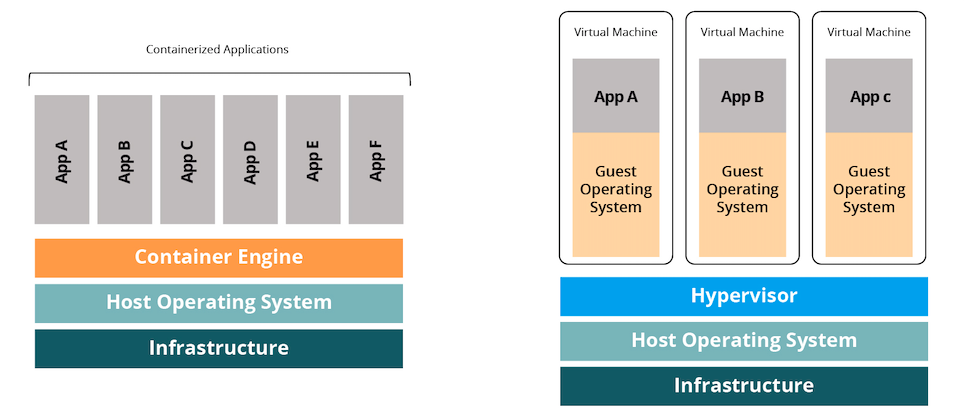

# Docker


```
enter code samples here
```

Hands-on Docker für Frontend-Entwickler

- installation instructions: website
- demo: docker run hello world, apache, ubuntu, texlive, node (node -v)
- nennen: MySQL, Mailhog, Wordpress
- demo: create image from ubuntu container (cli changes)
- demo: run commands in node: npm start, npm build (e.g. POPO) and create image from it
- demo: -e PORT=80 -e SERVER_NAME=Docker
- demo without Docker: export PORT=80 && node server.js (different time)
- demo: docker ps, stop, start, login, create an image from
- demo: GraphQL

## Docker


- Docker = Docker Engine
    - wenn "Docker" sagen, meinen wir Docker Engine
    - Client-Server Applikation, der Docker daemon
      - REST API für Interaktionen mit dem daemon
      - und command line interface (CLI) client, der über API mit daemon spricht
- Docker ist nur eine von mehreren Container-Plattformen
- aber ist Technologie der Wahl zum Packen und Deployen moderner verteilter Anwendungen
- der am meisten verwendete Container-Service und einfacher zu deployen als andere Technologien
- Open-Source, robust, sicher, kosteneffizient und bietet viele Features
- getragen von einer großen Community von Firmen und Einzelpersonen
- als führende Container-Plattform, bietet es guten Support und großes Ökosystem
- und es läuft auch auf Windows, ermöglicht durch einen Linux virtualization layer, der sich zwischen Windows und Docker befindet
- Docker Machines, WSL 2
- auch Windows Container werden unterstützt
- Docker ist damit beste Wahl für die Mehrheit der Anwendungsfälle
- Docker Desktop Download und Installation: https://www.docker.com/get-started

## Docker Container

- in einem Atemzug mit Docker sind Container zu nennen
- Container sind Umgebungen, die nur die Ressourcen bereitstellen, die eine Anwendung gerade benötigt
- im Gegensatz zu VM = Gast-Betriebssystem
- Docker kann so erforderliche Infrastruktur von Anwendungen signifikant reduzieren
- geringere Größe und einfacheres System bedeuten auch, dass Container schneller gestartet und gestoppt werden können als VMs
- deutlich responsiver hinsichtlich Skalierungsanforderungen



<!-- https://jfrog--c.eu12.content.force.com/servlet/servlet.ImageServer?id=0151r000006uDem&oid=00D20000000M3v0&lastMod=1584630235000 -->

- Container sind idealer Baustein für den modernen Cloud-Ansatz bei Softwarearchitekturen
- einem monolythischen Programm steht eine Ansammlung lose gekoppelter Microservices gegenüber
- Container bringen Vorteile bei der Replikation
- können Fehler tolerant sein: wenn Container failed -- Fallback auf andere Microservices im Cluster
- leichter zu warten: Patch oder Updates betreffen nur einen kleinen Teil des Clusters
- ihr kompaktes Design macht sie hoch portabel
- leicht zu integrieren in Continuous Integration (CI) oder Continuous Delivery (CD) Workflows
- sehr praktisches Werkzeug für Entwickler
- Projekte werden unabhängig von der Host-Umgebung, vom System des jeweiligen Entwicklers
- definierte Systemumgebung: Container verhalten sich auf jedem Host gleich, auch im CI Prozess
- Virtualisierung des Entwickler-Setups: einfaches (automatisiertes) Aufsetzen und Aktualisieren der Umgebung
- einfachere Migration und Duplikation von Umgebungen: Docker Repositories, Erweiterung der Instanzen
- wir können sie auf unterschiedlichen Servern mit verschiedenen Konfigurationen hosten

## Grundprinzip

- **Docker Engine**:
  - zu installierendes Programm zum Bauen, Starten und Managen der Container
- **Docker Daemon**:
  - Teil der Engine, der auf Anfragen hört und verarbeitet
- **Docker Client**:
  - CLI zur Kommunikation mit dem Docker System
- **Docker Image**:
  - ein nicht schreibbares Template (read-only) zum Erstellen von Docker Containern
  - Image besteht aus einer Reihe von Layern, welche alle erforderlichen Installationen, Abhängigkeiten, Libraries und Prozesse für eine vollständig lauffähige Container-Umgebung enthalten
  - ist der übliche Weg, um Anwendungen oder vorkonfigurierte Umgebungen zu packen, welche dann anderen Anwendern (Entwickler, DevOps, Repositories) zur Verfügung gestellt werden
  - Docker Images sind auch der Einstiegspunkt in die Dockerwelt
  - Beispiel-Images: Ubuntu, Apache, Nginx, MySQL, Wordpress, Mailhog usw. .... Node
- **Docker Container**:
  - eine "lebende" Instanz eines Docker Images, in welcher individuelle Microservices laufen oder gar ein ganzer Application Stack
  - Beim Starten eines Containers fügt man den darunterliegenden Image Layern einen oberen schreibbaren Layer hinzu (Container Layer)
  - Container speichert alle während der Laufzeit vorgenommenen Änderungen
- **Docker Registry**:
  - ein Katalagsystem zum Hosten, Pushen und Pullen von Docker images
  - eigene lokale Registry oder einer von vielen Registry Services von Drittanbietern (Amazon ECR, Google Container Registry oder Dockers eigene Registry "Docker Hub").


<!-- https://jfrog--c.eu12.content.force.com/servlet/servlet.ImageServer?id=0151r000006uDFc&oid=00D20000000M3v0&lastMod=1584523377000 -->


## Hands-on Docker

Docker ist dafür designed einzelne Prozesse in jedem Container auszuführen.

- https://labs.play-with-docker.com/


The `-it` instructs Docker to allocate a pseudo-TTY connected to the container’s stdin; creating an interactive bash shell in the container.

`-d` Detach = Run container in background and print container ID

## Docker Manifest

Dockerfile

## Installation

## Create a Docker Image

## Hello World

## Ablauf 


## Docker Compose

Docker-Compose is essentially a higher-level scripting interface on top of Docker itself, making it easier (ostensibly) to manage launching several containers simultaneously. Its config file (docker-compose.yml) is confusing since some of its settings are passed down to the lower-level docker process, and some are used only at the higher level.

## Docker Machine

Docker Machine is a tool for provisioning and managing your Dockerized hosts (hosts with Docker Engine on them). Typically, you install Docker Machine on your local system. Docker Machine has its own command line client docker-machine and the Docker Engine client, docker. You can use Machine to install Docker Engine on one or more virtual systems. These virtual systems can be local (as when you use Machine to install and run Docker Engine in VirtualBox on Mac or Windows) or remote (as when you use Machine to provision Dockerized hosts on cloud providers). The Dockerized hosts themselves can be thought of, and are sometimes referred to as, managed “machines”.

## Docker Swarm

## Kubernetes

## Praxisbeispiele aus der Entwicklung

- virtueller MySQL-Server ohne Installation
- Server zur Auslieferung statischer Inhalte läuft im Hintergrund
- Build-System läuft im Hintergrund
- INQA..

## Quellen

- [What Is Docker? A Beginner’s Guide](https://jfrog.com/knowledge-base/what-is-docker-why-use-docker-containers-a-beginners-guide/)
- [A Beginner’s Guide to Understanding and Building Docker Images](https://jfrog.com/knowledge-base/a-beginners-guide-to-understanding-and-building-docker-images/#:~:text=A%20Docker%20image%20is%20a,publicly%20with%20other%20Docker%20users.)
- https://jfrog.com/knowledge-base/6-alternatives-to-docker-all-in-one-solutions-and-standalone-container-tools/
- https://www.ionos.de/digitalguide/server/knowhow/kubernetes-vs-docker/
- https://www.edureka.co/community/51049/how-is-docker-machine-different-from-docker-engine
- https://www.macadamian.com/learn/docker-machine-basic-examples/
- https://phase2.github.io/devtools/common-tasks/ssh-into-a-container/
- https://stackoverflow.com/questions/24482822/how-to-share-my-docker-image-without-using-the-docker-hub
- https://stackoverflow.com/questions/22655867/what-is-the-difference-between-save-and-export-in-docker#:~:text=There%20are%20two%20main%20differences,smaller%20then%20the%20saved%20one.
- https://docs.docker.com/get-started/part2/
- https://docs.aws.amazon.com/cli/latest/userguide/install-cliv2-docker.html
- https://console.aws.amazon.com/ecs/home#/firstRun
- https://www.infoq.com/news/2020/07/docker-ecs-plugin/
- https://runnable.com/docker/install-docker-on-windows-10
- https://docs.docker.com/docker-for-windows/install/
- https://www.docker.com/101-tutorial
- https://labs.play-with-docker.com/