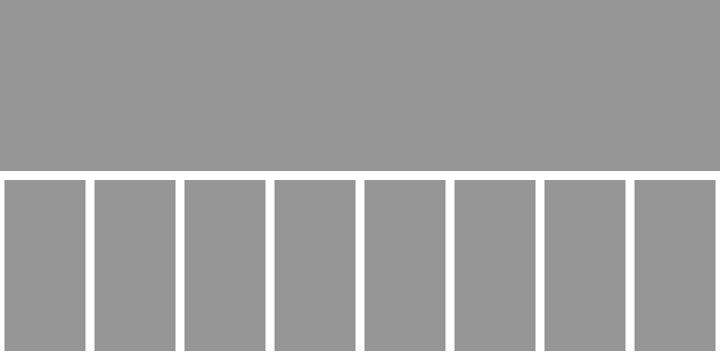
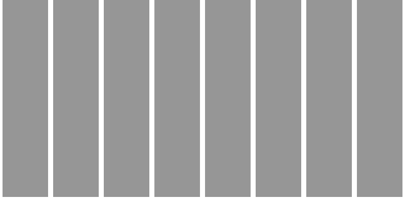

# Architektur und Strategien fürs Frontend

## Überblick

Frontend-Entwicklung umfasst heute eine große Bandbreite an verschiedensten Bereichen. Neben reiner CSS-Gestaltung spielen Themen wie unterschiedliche Endgeräte, schnelles Ladeverhalten, hohe Interaktivität, Barrierefreiheit, Testbarkeit und Sicherheit eine immer wichtigere Rolle.

## Überblick

Abgrenzung zwischen Frontend- und Backend-Entwicklern hilft dabei, wachsenden Anforderungen gerecht zu werden.

## Überblick

JS-Frameworks (React, Vue, Angular) bieten eigenes Komponentensystem und gewährleisten Wiederverwendbarkeit und Organisation des Quellcodes.

Wächst ein Projekt und damit auch das Team, ist irgendwann der Punkt erreicht, an dem die Weiterentwicklung der Software zäh und anstrengend wird. Änderungen an einer Stelle haben unerwartete Nebenwirkungen an anderer. Niemand hat mehr einen Gesamtüberblick über das Projekt. Technologische Erneuerung wie etwa das Wechseln einer zentralen Bibliothek oder das Upgrade eines Frameworks müssen von langer Hand geplant werden und bergen oft große Risiken.

Hier kommen Microservices ins Spiel. Im Gegensatz zu Monolithen wird Software in kleine, gut handhabbare und eigenständige Services zerlegt. Jeder Service hat eine spezielle Aufgabe und ist einem Entwicklungsteam zugeordnet. Oft ist dieses Zerlegen jedoch nur auf den Backend-Code begrenzt, das Frontend bleibt als Monolith oberhalb der Services erhalten. Um die Kommunikation zu erleichtern, wird zwischen Frontend und Backend gerne noch ein API-Gateway-Layer eingezogen. Er aggregiert die benötigten Daten von den jeweiligen Services und stellt sie dem Frontend für die Anzeige zur Verfügung.

Diese Architektur ist momentan sehr populär, bringt aber einige Probleme mit sich: So gibt es nun ein Skalierungskonzept für das Backend, das Frontend bleibt aber weiterhin ein Monolith. Javascript-Frameworks mit eigenem Komponentenmodell verstärken diese monolithische Struktur noch. Am einfachsten entwickelt es sich, wenn alle Teile der Seite mit dem gleichen Framework betrieben werden. Doch die Frontend-Welt bewegt sich schnell. Das Versionsupdate eines Frameworks wird schnell zu einer großen und unangenehmen Aufgabe, wenn die Beteiligten keinen Überblick über die gesamte Applikation haben – von großen Versionssprüngen wie von „Angular 1“ auf „Angular 2“ ganz abgesehen.

## Überblick

Der Ansatz, der sich jetzt förmlich aufdrängt, ist die Umsetzung der Microservice-Idee auch im Frontend. Anstatt einer ­großen Single-Page-Applikation baut man mehrere unabhängige Teilapplikationen, die miteinander kommunizieren. Diese sind dann deutlich einfacher zu verstehen. Der Einsatz einer neuen Technologie lässt sich in einem kleineren Rahmen testen. Auch die technische Erneuerung oder Reimplementierung einer Teilapplikation ist so eine leichter umzusetzende Aufgabe als die Big-Bang-Migration der ganzen Site.

Allerdings ist die Idee, neben den Backend-Microservices noch zusätzlich unabhängige Frontend-Microservices einzuführen, recht technisch gedacht und verkompliziert das Gesamtbild. Schaut man mit der Brille eines Produktmanagers auf das  Architekturdiagramm, wird das Problem deutlich: Die organisatorische Komplexität in diesem Modell ist sehr hoch. Um ein neues Feature für den Kunden zu entwickeln, müssten sich die Backend-Entwickler der betroffenen Services, das Frontend-Team und die Verantwortlichen für das API-Gateway untereinander abstimmen. Agile Werte wie „Schnelles Reagieren auf Änderungen“ blieben auf der Strecke.

## Foo

Überblick: Monolith, FE-BE-Monolithen, Microservice, Microfrontends, Web Components, externe Manipulationen des DOM

## Folgen externer Manipulationen mit Optimize, GTM etc.

## Vorteile eines Design Systems
                
##    