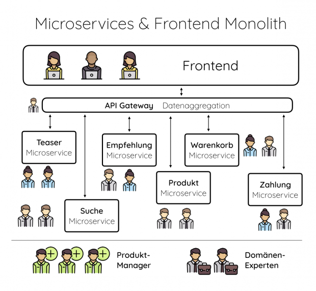
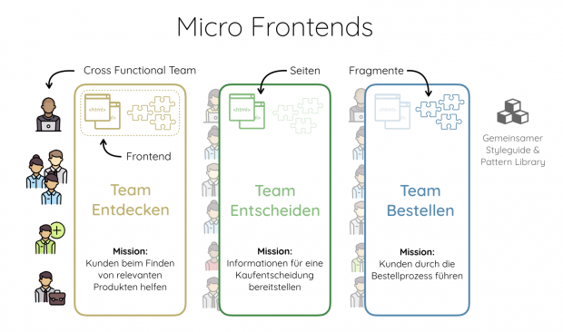
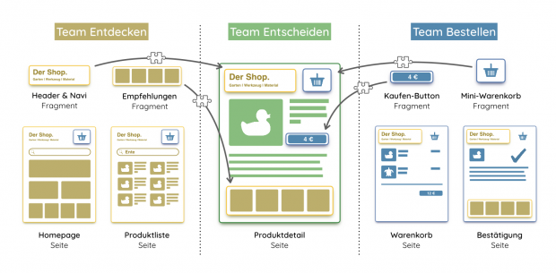

# Der modulare Shop

Frontend-Entwicklung umfasst heute eine große Bandbreite an verschiedensten Bereichen. Neben reiner CSS-Gestaltung spielen Themen wie unterschiedliche Endgeräte, schnelles Ladeverhalten, hohe Interaktivität, Barrierefreiheit, Testbarkeit und Sicherheit eine immer wichtigere Rolle.

Abgrenzung zwischen Frontend- und Backend-Entwicklern hilft dabei, wachsenden Anforderungen gerecht zu werden.

JS-Frameworks (React, Vue, Angular) bieten eigenes Komponentensystem und gewährleisten Wiederverwendbarkeit und Organisation des Quellcodes.

Wächst ein Projekt und damit auch das Team, ist irgendwann der Punkt erreicht, an dem die Weiterentwicklung der Software zäh und anstrengend wird. Änderungen an einer Stelle haben unerwartete Nebenwirkungen an anderer. Niemand hat mehr einen Gesamtüberblick über das Projekt. Technologische Erneuerung wie etwa das Wechseln einer zentralen Bibliothek oder das Upgrade eines Frameworks müssen von langer Hand geplant werden und bergen oft große Risiken.

Hier kommen Microservices ins Spiel. Im Gegensatz zu Monolithen wird Software in kleine, gut handhabbare und eigenständige Services zerlegt. Jeder Service hat eine spezielle Aufgabe und ist einem Entwicklungsteam zugeordnet. Oft ist dieses Zerlegen jedoch nur auf den Backend-Code begrenzt, das Frontend bleibt als Monolith oberhalb der Services erhalten. Um die Kommunikation zu erleichtern, wird zwischen Frontend und Backend gerne noch ein API-Gateway-Layer eingezogen. Er aggregiert die benötigten Daten von den jeweiligen Services und stellt sie dem Frontend für die Anzeige zur Verfügung.

Diese Architektur ist momentan sehr populär, bringt aber einige Probleme mit sich: So gibt es nun ein Skalierungskonzept für das Backend, das Frontend bleibt aber weiterhin ein Monolith. Javascript-Frameworks mit eigenem Komponentenmodell verstärken diese monolithische Struktur noch. Am einfachsten entwickelt es sich, wenn alle Teile der Seite mit dem gleichen Framework betrieben werden. Doch die Frontend-Welt bewegt sich schnell. Das Versionsupdate eines Frameworks wird schnell zu einer großen und unangenehmen Aufgabe, wenn die Beteiligten keinen Überblick über die gesamte Applikation haben – von großen Versionssprüngen wie von „Angular 1“ auf „Angular 2“ ganz abgesehen.

### Microservices auch­ im Frontend einsetzen?

Der Ansatz, der sich jetzt förmlich aufdrängt, ist die Umsetzung der Microservice-Idee auch im Frontend. Anstatt einer ­großen Single-Page-Applikation baut man mehrere unabhängige Teilapplikationen, die miteinander kommunizieren. Diese sind dann deutlich einfacher zu verstehen. Der Einsatz einer neuen Technologie lässt sich in einem kleineren Rahmen testen. Auch die technische Erneuerung oder Reimplementierung einer Teilapplikation ist so eine leichter umzusetzende Aufgabe als die Big-Bang-Migration der ganzen Site.

Allerdings ist die Idee, neben den Backend-Microservices noch zusätzlich unabhängige Frontend-Microservices einzuführen, recht technisch gedacht und verkompliziert das Gesamtbild. Schaut man mit der Brille eines Produktmanagers auf das  Architekturdiagramm, wird das Problem deutlich: Die organisatorische Komplexität in diesem Modell ist sehr hoch. Um ein neues Feature für den Kunden zu entwickeln, müssten sich die Backend-Entwickler der betroffenen Services, das Frontend-Team und die Verantwortlichen für das API-Gateway untereinander abstimmen. Agile Werte wie „Schnelles Reagieren auf Änderungen“ blieben auf der Strecke.

### Micro-Frontends – Schnitte aus ­Kundensicht

Das Konzept der Micro-Frontends geht also noch einen Schritt weiter. Eine Anwendung wird nicht in horizontale Stücke – ­Front- end, Gateway, Backend – geteilt, sondern in vertikale. Jede ­Vertikale wird von einem interdisziplinären Team entwickelt, ­welches für den gesamten Stack, von Datenbank bis Benutzer­oberfläche, verantwortlich ist. Es gibt also keine separaten Frontend- und Backend-Teams mehr. Die Teams sind, ähnlich wie bei Microservices, frei in der Wahl ihrer Arbeitsweise und Technologie und können autonom arbeiten. Man kann sich das System wie einen in die Höhe gezogenen Microservice vorstellen: ein Microservice mit eigenem Frontend, andernorts auch als Self-Contained-System bezeichnet.

Die vertikalen Schnitte werden nicht nach technischen ­Gesichtspunkten, sondern anhand der Kundenbedürfnisse festgelegt. In einem Onlineshop können dies beispielsweise die Phasen des Kaufprozesses sein. Im Schaubild ist ein Beispiel mit drei Vertikalen dargestellt. Team „Entdecken“ hat die Aufgabe, den Kunden bei der Suche nach relevanten Artikeln zu unterstützen, Team „Entscheiden“ stellt ihm alle Artikeldetails für eine Kaufentscheidung zur Verfügung und Team „Bestellen“ führt ihn durch den Bestellprozess. Jedes dieser Teams hat eine klar umrissene Aufgabe, auf die es sich spezialisiert. Der Verantwortungsbereich eines Teams ist deutlich kleiner als bei einem Monolithen. Je nach Größe des Projekts können die Schnitte natürlich auch noch kleiner gefasst werden.

Der Versandhändler OTTO hat 2011 seine E-Commerce-Plattform (Projekt „Lhotse“) nach diesem Konzept neu aufgebaut. Auch Firmen wie Zalando (Project „Mosaic“), Galeria Kaufhof,
Breuninger, Autoscout24 und Manufactum haben sich in den letzten Jahren so aufgestellt. Vertikalisierung ist aber keineswegs ein Phänomen der E-Commerce-Branche: Auch Unternehmen wie die LVM-Versicherung, die Ratgeberseite gutefrage.net oder der Logistiker Kühne+Nagel bauen um. Berichten zufolge sind die Entwicklungsteams der Internet-Riesen Facebook und Amazon schon lange ähnlich organisiert.

Sind die Schnitte gut gewählt, bringt diese Art der Strukturierung einen enormen Geschwindigkeitsvorteil in der Entwicklung. Neue Features können vom betreffenden Team alleine entwickelt und live gebracht werden, da es alle nötigen Fähigkeiten mitbringt. Man spricht auch von einem Cross-Functional-Team. Personen mit unterschiedlichen Fähigkeiten wie UX-Design,
Datenmodellierung, Skalierung, Sicherheit, Produktmanagement oder tiefem fachlichem Wissen arbeiten eng zusammen und lernen voneinander.

### Verschiedene Zuständigkeiten, ein ­Erscheinungsbild

Der Besucher der Website soll von dieser internen Teamstruktur jedoch nichts mitbekommen. Die größte Herausforderung im ­Zusammenhang mit Micro-Frontends ist daher die möglichst nahtlose Integration der einzelnen vertikalen Frontends untereinander. Dabei müssen jedoch Kernwerte wie technische Entkopplung und unabhängige „Deploybarkeit“ möglichst erhalten bleiben. Im Folgenden werden einige Integrationsmuster kurz umrissen.

Im einfachsten Fall kann die Integration auf Seitenebene über normale Links erfolgen. Eine solche Lösung trifft man in der E-Commerce-Welt häufig an, wenn ein Blog-System eingebunden wird. Das Blog ist aus dem Shop verlinkt. Alle Seiten, deren URL mit /blog beginnt, werden nicht vom eigentlichen Shop-System, sondern von einer eigenständigen Blog-Software ausgespielt. Aus den Blog-Artikeln wird dann wieder auf die jeweiligen Produkte im Shop verlinkt. Beide Systeme sind autark. Gibt es ein technisches Problem im Blog, läuft der Shop trotzdem unbeeindruckt weiter – und umgekehrt.

Auch im Beispiel der drei am Kaufprozess orientierten Teams „Entdecken“, „Entscheiden“ und „Bestellen“ betreibt jedes Team eine eigenständige Applikation mit eigener Datenhaltung. Dabei
sind jedem Team bestimmte Seitentypen zugeordnet: Team „Entdecken“, verantwortlich für das Auffinden des gewünschten Artikels, betreibt Homepage, Kategorie- und Suchseiten. Team „Entscheiden“ stellt dem Benutzer auf der Detailseite alle kaufrelevanten Informationen wie technische Daten, verfügbare Farben und Größen, aber auch Kundenrezensionen zur Verfügung. Team „Bestellen“ managt die Seiten des Bestellprozesses vom Warenkorb bis hin zur Bestätigungsseite und kümmert sich dabei auch um Kundenlogin und Zahlungsabwicklung. Die beschriebenen Seiten sind untereinander verlinkt. Damit es für den Benutzer nicht zu visuellen Brüchen kommt, wird meist ein gemeinsam verwendeter CSS-Styleguide, beziehungsweise eine Pattern Library,
etabliert. Dort sind neben Farbschema, Typographie und Iconsprache auch wiederverwendbare UI-Komponenten wie Buttons, Tooltipps oder die Artikel-Kacheln zu finden.

### Das große Fragmente-Puzzle

Eine Integration auf Seitenebene ist jedoch nicht immer ausreichend. Auf einigen Seiten ist es erforderlich, direkt Informationen anzuzeigen, die im Verantwortungsbereich eines anderen Teams liegen. So soll beispielsweise der Header mit Navigation auf allen Seiten angezeigt werden. Team „Entdecken“, verantwortlich für das Auffinden von Artikeln, stellt dieses Element als Fragment bereit, welches von den anderen Teams inkludiert werden kann. Im Gegensatz zu den UI-Komponenten aus der Pattern Library sind Fragmente eigenständige Mini-Applikationen, welche sich auch um die Datenbeschaffung kümmern. Möchte Team „Ent­decken“ beispielsweise mit personalisierter Ausspielung von Naviga­tionspunkten experimentieren, kann es das einfach im Header-
Fragment machen, ohne sich mit den einbindenden Teams abstimmen zu müssen.

Für das Inkludieren gibt es unterschiedliche technische ­Möglichkeiten. Die einfachste Lösung ist der gute alte iFrame. Hierfür muss dem einbindenden System neben der URL auch die genaue Höhe des Inhalts bekannt sein – ein Umstand, der ihn in Zeiten des Responsive Webdesigns unbrauchbar macht. Zudem verursacht der iFrame Probleme mit Accessibility, SEO und schnellem Seitenaufbau.

Eine häufig anzutreffende Lösung für die Inklusion von Fragmenten in Seiten ist auch die Integration auf Server-­Ebene. Anstelle des Headers bindet Team „Bestellen“ einfach einen ­speziellen HTML-Kommentar wie `<!--#include virtual=“/entdecken-header“ -->` ein, welcher dann von einem vorge­lagerten Webserver wie Nginx oder Apache durch das Markup des richtigen Headers aus Team „Entdecken“ ersetzt wird. Die hier zum Einsatz kommende Technik nennt sich Server-Side-­Includes (SSI) oder Edge-Site-Includes (ESI). Diese Standards existieren schon seit fast zwanzig Jahren und müssen im Webserver meist nur aktiviert werden. Im Gegensatz zum iFrame-Ansatz bekommt man bei dieser Lösung jedoch keinerlei Isolation für Styles und Skripte. Um ungewollte Seiteneffekte zu vermeiden, müssen sich hier vorab alle Teams auf Präfixe und Namens­konventionen, etwa für CSS-Klassen, einigen.

Um schneller auf Nutzereingaben reagieren zu können, wird das Markup inzwischen gerne direkt im Browser erzeugt und upgedated. Um Client-Side-Rendering zu unterstützen, wird eine Integration auf Browser-Ebene, sprich Javascript, benötigt. Web-Components sind seinerzeit angetreten, um ein natives Komponenten-System, ähnlich wie in React und Angular, als neutralen Web-Standard zu etablieren. Bis jetzt hat es jedoch nur ein Teilaspekt in die aktuellen Browser geschafft: Custom-­Elements. Sie bieten Entwicklern die Möglichkeit, ein eigenes HTML-­Element zu definieren und es mit Javascript-Code zu verknüpfen. Jedes Team registriert demnach ein HTML-Tag für die Fragmente, die es anderen Teams zur Verfügung stellen möchte. Das vorherige Beispiel würde dann so aussehen: `<entdecken-header></entdecken-header>`. Sobald der Browser ein solches Element ­findet, ruft er den entsprechenden Javascript-Code für den Header von Team „Entdecken“ auf. Dieser kümmert sich dann gegebenenfalls um das Laden von Daten und rendert seinen eigenen Inhalt in das Element. Jedes Fragment ist somit eine Mini-­Javascript-Anwendung, die mittels eines beliebigen Frameworks implementiert sein kann. Das Fragment kann über DOM-Attribute vom inkludierenden System parametrisiert werden und sich entsprechend aktualisieren `<entdecken-header mode=“compact“>`. Es kann aber auch andere Teile der Seite mittels nativer Browser-Events beziehungsweise Custom-Events über Neuigkeiten informieren. Custom-Elements funktionieren nur im Browser. Beim initialen Laden der Seite verhält sich das neue HTML-Tag wie ein leeres div und wird erst durch Javascript zum Leben erweckt. Um ein Flackern der Seite zu verhindern – und um wichtige ­Inhalte möglichst schnell zur Anzeige zu bringen – lässt sich der Custom-Element-Ansatz auch mit SSI für den ersten Seitenaufruf kombinieren.

### Fazit

Micro-Frontends bringen eine Menge Vorteile mit sich. Die autonomen Teams können schnell agieren und auch tiefgreifende technische Änderungen auf dem „kurzen Dienstweg“ umsetzen. Durch den überschaubaren Funktionsbereich einer Vertikale steigt außerdem das Identifikationspotenzial: Jedes Team hilft dem Benutzer, eine konkrete Aufgabe erfolgreich zu erledigen. Niemand entwickelt ohne Rückbindung an Kundenbedürf­nisse. Allerdings stellt die Integration von Oberflächenfragmenten unterschiedlicher Teams hohe Anforderungen an Organisation und Architektur. Neben der nahtlosen Integration der einzelnen Frontends gehören auch das Sicherstellen einer schnellen Ladegeschwindigkeit und die Konzeption einer guten Pattern-Library zu den Herausforderungen.

## TODOs

- [ ] Welche Thirdparty-Elemente werden integriert?
- [ ] Barrierefreiheit
- [ ] SEO
- [ ] Datenanbindung mittels innerem Tag `<my-component><my-data product="123"><h1>product name override</h1></my-data></my-component>`
- [ ] Browserkompatibilität
- [ ] Rendering in Hybris-Tags
- [ ] Rendering in SmartEdit-Komponenten
- [ ] Integration über GTM
- [ ] GTM-Konzept: allein 3rd-party bzw. Marketing in GTM auslagern

## Quellen, Links und Bilder

- https://t3n.de/magazin/micro-frontends-modular-entwickeln-244415/
- https://blogs.itemis.com/de/6-micro-frontend-arten-im-direkt-vergleich
- https://help.sap.com/viewer/86dd1373053a4c2da8f9885cc9fbe55d/6.6.0.0/en-US/b13701dcd2d44e5c97a36732167405a0.html
- https://help.sap.com/viewer/86dd1373053a4c2da8f9885cc9fbe55d/6.6.0.0/en-US/6d55d5fba206425b9acecda9f2311483.html

