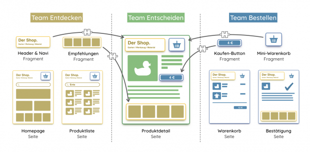

# Web Components

## Was ist das?

> Webkomponenten sind eine Gruppe von Funktionen, die ein Standardkomponentenmodell für das Web bereitstellen und die Kapselung und Interoperabilität einzelner HTML-Elemente ermöglichen.

> Unterstützt von allen gängigen Browsern. Für IE11 werden Polyfills benötigt.

## Was kann man damit machen?

```
<h1></h1>
```

## Was kann man damit machen?

```

```

## Was kann man damit machen?

```
<cookie-banner confirm="/confirm/cookies">
    <h1>Kekse essen wir</h1>
    <p>Mampf... <a href="/kekse">Infos</a></p>
</cookie-banner>
```

## Anfänge

- ursprünglich 2011 auf der [Fronteers Conference](https://fronteers.nl/congres/2011/sessions/web-components-and-model-driven-views-alex-russell) eingeführt
- in letzten Jahren eng mit Polymer verknüpft
- Vergleich mit Frameworks wird [diskutiert](https://dev.to/richharris/why-i-don-t-use-web-components-2cia)
- inzwischen aber in den meisten aktuellen Browsern angekommen
- veralteter Browser wird über JS-Polyfills unterstützt

## Vorteile von Web Components

1. durch eigenen Scope unabhängiges und stabiles Layout
2. einfache Integration in das HTML-Markup
3. dadurch universell einsetzbar (Templates, SSR, JS, Vue, GTM, A/B)
4. lassen sich wie natürliche HTML-Elemente verwenden

## Daten übergeben

```
<cookie-banner
    confirm="/confirm/cookies"
    local-storage="cookie-confirmation"
    closeable fullscreen>
    <button>Okay</button>
</cookie-banner>
```

- Attribute als String oder Boolean
- inneres HTML zur Befüllung eines (oder mehrerer) (benamter) Slots

## Daten übergeben

```
<cookie-banner
    data="`${JSON.stringify({button:"OK", closeable:true})}`"
    >
    <h1 slot="headline"></h1>
    <button slot="buttons"></button>
</cookie-banner>
```

- Attribute als String oder Boolean
- inneres HTML zur Befüllung eines (oder mehrerer) (benamter) Slots

## Interaktion mit JavaScript

```
document.querySelector('cookie-banner')
    // Attribute setzen
    setAttribute('local-storage', 'other-storage-name')

    // custom events
    .addEventListener('confirmed', e => {
        if (e.target.hasAttribute('fullscreen')) {
            e.target.removeAttribute('fullscreen')
        }
    })
```

## Technische Grundlagen

- ***Custom Elements:*** API um eigene HTML Elemente zu schreiben oder bestehende zu erweitern
- ***Shadow DOM:*** gekapseltes unabhängiges DOM, scoped CSS ermöglicht risikofreies Styling
- ***HTML Templates:*** mit `<template>` Element HTML Vorlagen erstellen und im DOM hinterlegen, mit JS manipulieren und nutzen


## Styling

- Elemente im Shadow DOM vor Zugriff von außen geschützt
- Komponenten-Wurzel von außen stylebar
- definierte Modifikationen über CSS-Variablen (Aktionswochen)

```
:host { /* in Komponente der Root */ }
:host([attribute]) { /* Komponente mit Attribut */ }
::slotted(*) { /* alle Elemente des Slots */ }

headline-component { /* stärker als Root und slotted */ }

:root, headline-component { --border-color: red; }
```

[Styling einer Web Component](../WEBCOMPONENTS/example/styling.html)


## Native HTML Elemente erweitern

```
class OkButton extends HTMLButtonElement {
    constructor() {
        super()
        this.addEventListener('click',
            e => this.clickHandler(e.offsetX, e.offsetY)
        )
    }
    clickHandler(x, y) {
        console.log('click handler:', x, y)
    }
}
```

## Native HTML Elemente erweitern

```
customElements.define(
    'ok-button',
    OkButton,
    { extends: 'button' }
)
```

## Native HTML Elemente erweitern

```
<button
    is="ok-button"
    class="p-4"
    onclick="console.log('button click');"
    >OK</button>
```

[Beispiel mit nativem HTML Element](../WEBCOMPONENTS/example/button.html)

Safari hat beschlossen, customized built-in elements nicht zu implementieren.

## Eigenständige Elemente erstellen

```
CookieBanner extends HTMLElement {
    constructor() {
        super();
    }
}

window.customElements.define("cookie-banner", CookieBanner);
```

## Eigenständige Elemente erstellen

```
CookieBanner extends HTMLElement {
    constructor() {
        super();
    }

    connectedCallback() {}      // element added to DOM
    disconnectedCallback() {}   // element removed from DOM
    adoptedCallback() {}        // element moved inside of DOM

    static get observedAttributes() {
        // list of attributes to be watched
        return ["confirm"];
    }

    attributeChangedCallback(name, oldVal, newVal) {
        // some attribute has changed
    }
}

window.customElements.define("cookie-banner", CookieBanner);
```


## Shadow DOM

```
CookieBanner extends HTMLElement {
    constructor() {
        super();

        const template = document.createElement("template");
        template.innerHTML = `
    <style>:host { position: fixed; }</style>
    <div>
        <h1>Cookies</h1>
        <slot name="buttons"></slot>
    </div>
`;

        this.attachShadow({ mode: "open" });
        this.shadowRoot.appendChild(template.content.cloneNode(true));
        this.headline = this.shadowRoot.querySelector('h1');
    }

    connectedCallback() {
        this.headline.textContent = this.getAttribute("headline");
    }
}
```

## Implementierung

[Beispiel mit eigenem HTML Element](../WEBCOMPONENTS/example/index.html)

## Custom Elements erweitern

```
SuperCookieBanner extends CookieBanner {
    constructor() {
        super();
    }
}

window.customElements.define("super-cookie-banner",
    SuperCookieBanner);
```

z.B. für A/B-Tests etc.

## Architektur-Ansätze

- Light DOM Approach
- Shadow DOM with a Slot Approach
- Attribute Approach

### Light DOM Approach

shadow root with a slot that will accept anything.

```
class WcHeaderLightDom extends HTMLElement {
  constructor() {
    super();

    this.attachShadow({ mode: "open" });
    this.shadowRoot.innerHTML = `
      <style>
        :host {
          display: block;
        }
      </style>
      <slot></slot>
    `;
  }
}

window.customElements.define("wc-header-light-dom", WcHeaderLightDom);

<wc-header-light-dom>
  <h2>Header in the Light DOM</h2>
</wc-header-light-dom>
```

### Shadow DOM with a Slot Approach

component has a shadow root with an H2 and a slot inside the H2 for the text.

```
class WcHeaderJustSlot extends HTMLElement {
  constructor() {
    super();

    this.attachShadow({ mode: "open" });
    this.shadowRoot.innerHTML = `
      <style>
        :host {
          display: block;
        }
      </style>
      <h2><slot></slot></h2>
    `;
  }
}

window.customElements.define("wc-header-just-slot", WcHeaderJustSlot);

<wc-header-just-slot>
  Header with Just a Slot
</wc-header-just-slot>
```

### Attribute Approach

component has a shadow root with an H2 and no slot. on attribute change, set textContent property of H2 in the shadow root.

```
class WcHeaderNoSlot extends HTMLElement {
  static get observedAttributes() {
    return ["text"];
  }

  constructor() {
    super();

    this.attachShadow({ mode: "open" });
    this.shadowRoot.innerHTML = `
      <style>
        :host {
          display: block;
        }
      </style>
      <h2></h2>
    `;
  }

  attributeChangedCallback(attr, oldValue, newValue) {
    this.shadowRoot.querySelector("h2").textContent = newValue;
  }
}

window.customElements.define("wc-header-no-slot", WcHeaderNoSlot);

<wc-header-no-slot text="Header without a Slot"></wc-header-no-slot>
```

## SEO

> Light DOM Approach is working best, https://medium.com/patternfly-elements/web-components-and-seo-58227413e072


## Hilfsmittel

Einige Libraries wollen helfen, den Abstraktionslevel für custom elements zu erhöhen:

- Polymer, LitElement
- Slim.js, X-Tag, Stencil
- Angular, React, Svelte, Vue

## Hilfsmittel?

- langfristiges Projekt?
- keine Bindung an Frameworks oder Bibliotheken erwünscht?

> **⟿ Vanilla Web Components in Erwägung ziehen**

> **⟿ progressive Lösungsansätze als Alternative zu IE11-Polyfills prüfen**

Vanilla Web Components benötigen keinen Buildprozess und erlauben eine freie Auswahl des Implementierungsorts: statisches FE, GTM, A/B, ...

## Design Systeme

Web Components sind mit Design Systemen gut vereinbar.
Können z.B. mit Storybook oder Fractal leicht entwickelt und dokumentiert werden:

- Wie erfolgt Integration?
- Welche Attribute vorhanden?
- Welche Slots?
- Welche Event-Listener zur Kommunikation nach außen?
- [Web Component Analyzer](https://github.com/runem/web-component-analyzer) & Storybook ([Playground](https://runem.github.io/web-component-analyzer/))


##

## Design Systeme

> Verwendung von Web Components mit einem Design System ist empfehlenswert, insbesondere bei Projekten mit Micro Frontend-Architektur.




> https://micro-frontends.org/


## Links

- [Wikipedia](https://en.wikipedia.org/wiki/Web_Components)
- [Ein Blick auf Web Components](https://blog.codecentric.de/2018/10/ein-blick-auf-web-components/)
- [Custom Elements](https://developers.google.com/web/fundamentals/web-components/customelements)
- [Using Custom Elements](https://developer.mozilla.org/en-US/docs/Web/Web_Components/Using_custom_elements)
- [Element Interfaces](https://html.spec.whatwg.org/multipage/indices.html#element-interfaces)
- [HTMLButtonElement Web API](https://developer.mozilla.org/en-US/docs/Web/API/HTMLButtonElement)
- [Handling data with web components](https://itnext.io/handling-data-with-web-components-9e7e4a452e6e)
- [LitElement](https://lit-element.polymer-project.org/)
- [Tagged Templates](https://developers.google.com/web/updates/2015/01/ES6-Template-Strings#tagged_templates)
- [Event Handling in Web Components](https://lit-element.polymer-project.org/guide/events)
- [Are Web Components useable in IE11 and Edge](https://stackoverflow.com/questions/47902255/are-web-components-actually-useable-in-ie11-and-edge)
- [Web Components and SEO](https://medium.com/patternfly-elements/web-components-and-seo-58227413e072)
- [customized built-in not in Safari](https://developers.google.com/web/fundamentals/web-components/customelements#extendhtml)
- [Micro Frontends](https://micro-frontends.org/)
- [Lets Build ...](https://dev.to/bennypowers/lets-build-web-components-part-3-vanilla-components-4on3)
- [Lazy Image](https://github.com/bennypowers/lazy-image)
- [Storybook HTML](http://derhess.de/2019/04/22/storybook-html-tutorial-part-3-handlebarjs-and-sass-integration/)
- [Combine WC with Storybook](https://medium.com/storybookjs/how-to-combine-web-components-with-storybook-a-match-made-in-heaven-9d9939eedc76)

## Hinweise

- Bundling: automatisches Babel-Polyfill für Transpiling Ding von Marvin oder @babel/polyfill für alle Polyfills
